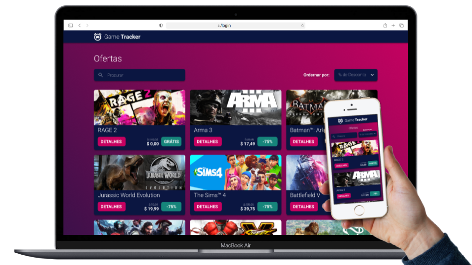

# :iphone: Game Tracker :video_game:

## :pencil2: About/Sobre

  
<strong>:us: English</strong>
 

Front-End Technical Project/Challenge using Vue.js developed by [Rodrigo Camargo](https://www.linkedin.com/in/rodrigocamargobr/).

I developed a website based on GameTracker, consuming external data from CHEAPSHARK API, implementing all the functionalities requested by the company.

[Click here](https://rodcamargo-gametracker.surge.sh/) to check out the final version of the project on your browser.

 

  
<strong>:brazil: Português</strong>
 

Projeto / Desafio Técnico Front-End utilizando Vue.js desenvolvido por [Rodrigo Camargo](https://www.linkedin.com/in/rodrigocamargobr/).

Com o objetivo de desenvolver um site baseado em GameTracker, consumindo dados externos de CHEAPSHARK API, implementando todas as funcionalidades solicitadas pela empresa.

[Clique aqui](https://rodcamargo-gametracker.surge.sh/) para visualizar a aplicação em seu navegador.
 

## :man_technologist: Developed Skills/Habilidades Desenvolvidas

  
<strong>:us: English</strong>
 

* Create a Front-end application using Vue.js.
* Implement responsive design with CSS flexbox and Grid from a FIGMA layout.
* Consume data from external API.

 

  
<strong>:brazil: Português</strong>
 

* Criar uma aplicação Front-end utilizando Vue.js.
* Implementar design responsivo com CSS flexbox e Grid a partir de um layout FIGMA.
* Consumir dados de API externa.

 

## :hammer_and_wrench: Tools/Ferramentas

* HTML5
* CSS3
* JavaScript ES6+
* Vue.JS
* Figma
